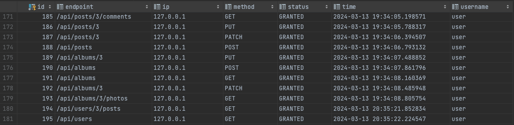

# VK Internship by Иванов Никита Денисович

Добро пожаловать в мое тестовое задание на стажировку в VK!

## Требования:

## 1. Реализовать обработчики, которые проксируют запросы к [JsonPlaceHolder](https://jsonplaceholder.typicode.com/)

Быил реализованы обработчики (**GET, POST, PUT, PATCH, DELETE**) на следующих эндпоинтах:

* **/api/posts/**** проксирует запросы на [jsonplaceholder.typicode.com/posts](https://jsonplaceholder.typicode.com/posts)
* **/api/albums/**** проксирует запросы на [jsonplaceholder.typicode.com/albums](https://jsonplaceholder.typicode.com/albums)
* **/api/users/**** проксирует запросы на [jsonplaceholder.typicode.com/users](https://jsonplaceholder.typicode.com/users)

## 2. Реализовать базовую авторизацию.

Базовая авторизация была реализована посредством Spring Security и JWT токена (access и refresh).

* **/api/auth/signin** авторизация (выдача access и refresh токенов)
* **/api/auth/signup** регистрация (выдача access и refresh токенов)
* **/api/logout** выход (удаление access и refresh токенов)

## 3. Проработать ролевую модель.

Была реализована расширенная ролевая модель, которая включает как роль администратора, так и отдельные роли для доступа 
к разным обработчикам, с разными возможностями (есть роли, которые могу редактировать данные, создавать новые, а есть и 
те роли у которых доступ только на чтение)

## 4. Реализовать ведение аудита действий.

Аудит реализован в папочке [AuthorizationEventPublisherImpl](./src/main/java/com/example/vk/audit/AuthorizationEventPublisherImpl.java)

Поля аудита и то, как он хранится в базе данных вы можете увидеть на картинке ниже:



## 5. Реализовать inmemory кэш.

Использовался `caffeine` кэш со следующей конфигурацией `spring.cache.caffeine.spec=maximumSize=500,expireAfterAccess=600s`.
Ее вы можете найти в файле `application.properties`

## Дополнительно

## 0. Простота сборки приложения

Для сборки используется `maven`, чтобы собрать и запустить приложение необходимо из корня проекта выполнить следующие команды:
```bash
mvn clean install
java -jar target/vk-0.0.1-SNAPSHOT.jar  
```
 
## 1. Использование базы данных для ведения аудита и хранения данных о пользователях

Для проекта использовалась база данных `PostgreSQL` с мануалом по ее настройке вы можете ознакомиться по [ссылке](./links/databases.md)


#### 2. Rest API для создания пользователей
Для регистрации пользователей был реализован следующий endpoint:
* **/api/auth/signup** регистрация (выдача access и refresh токенов)

#### 3. Расширенная ролевая модель

Добавлены роли, которые имеют права исключительно на чтение или на редактирование в соответсвии с ТЗ:
`ROlE_POSTS_VIEWERS, ROLE_POSTS_EDITORS, ...`

## 4. Написать тесты

В тестах производилась проверка соответсвия того, что выдаст прямое обращение к API и того, что выдаст обращение к нашему приложению.

Тесты для всех обработчиков написаны здесь: [src/test/java/com/example/vk](./src/test/java/com/example/vk)

## 5. Реализовать конечную точку для запросов по websocket

Точка была реализована по адресу `/ws`

Для подключения к этой точке необходим быть `Администратором`.

## Резюме
Вы можете ознакомиться с моим резюме [здесь](https://drive.google.com/file/d/1XvFd10oVKiipZvqD-czDH5gOgA3K0WWy/view?usp=sharing). В резюме вы найдете информацию о моем опыте работы, образовании и ключевых навыках.

## Связь со мной

Если у вас есть вопросы, предложения или вы хотите связаться со мной, вы можете написать мне в телеграмм [@Nikita262672](https://t.me/Nikita262672)
Или на почту iwaa0303@mail.ru

Благодарю за интерес к моему проекту!

---
**Примечание:** Этот проект разработан исключительно в учебных и демонстрационных целях.
